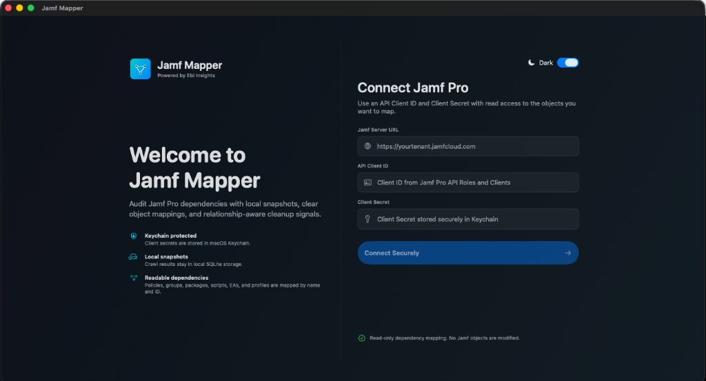

# Jamf Mapper

Jamf Mapper is a native macOS SwiftUI application designed to securely crawl Jamf Pro configuration objects, map their dependencies into a local graph, and provide deep insights to help you audit and optimize your Jamf environment.



## What Is Implemented

- **Secure Authentication:** Uses OAuth client credentials with secrets stored securely in the macOS Keychain (`kSecClassGenericPassword`).
- **Multi-Tenant Support:** Manage multiple Jamf Pro connection profiles stored locally via GRDB (SQLite).
- **Comprehensive Crawling:** Read-only crawler for Classic API core objects (Policies, Smart Groups, Scripts, Extension Attributes, etc.) and selected Jamf Pro API collections.
- **Dependency Extraction:** Intelligently maps relationships for policies, groups, extension attributes, profiles, patch policy references, packages, scripts, categories, and scope relationships.
- **Rich Visualization:** A powerful SwiftUI macOS shell featuring a sidebar, a Cytoscape-backed interactive graph web view, an inspector panel, search, type filters, and orphan filtering.
- **Actionable Cleanup Signals:** Advanced algorithms identify:
  - Orphaned objects
  - Empty groups
  - Duplicate scripts
  - Circular smart group criteria (critical for performance)
  - High blast-radius groups
  - Stale disabled policies
  - Safe-delete ordering sequences
- **Data Export:** Supports exporting the graph to JSON, CSV, and `.jamfmapper` bundles.

## Requirements

- **macOS 13.0** or later.
- **Xcode 15+** (for building from source).

## How to Build and Run in Xcode

JamfMapper is built using the Swift Package Manager (SPM). There is no `.xcodeproj` or `.xcworkspace` file needed.

1. **Open the Project:**
   Simply double-click the `Package.swift` file located in the root of this repository, or open Xcode and select **File > Open** and choose the `JamfMapper` folder.
   
2. **Resolve Dependencies:**
   Xcode will automatically read `Package.swift` and begin resolving dependencies (such as GRDB) in the background. Wait for the resolution to complete.

3. **Select the Target:**
   At the top of the Xcode window in the toolbar, ensure the **JamfMapper** executable target is selected and targeting **My Mac**.

4. **Run:**
   Press `Cmd + R` or click the **Play** button in the toolbar to build and run the application. 

*Alternatively, you can run from the terminal:*
```bash
swift build
./script/build_and_run.sh run
```

## Security & Privacy Notes

- **Read-Only:** The app is intentionally built as a read-only dependency mapper for safety. **No objects in your Jamf Pro instance are ever modified.**
- **Local Storage:** All crawled data (snapshots, graphs) and connection profiles are stored entirely locally on your Mac.
- **Secrets:** API Client Secrets are never stored in the database. They are securely written to and read from the macOS Keychain.

## Roadmap

- App Installer and deeper DDM/Blueprint mapping are currently feature-gated until stable tenant-exposed endpoints are confirmed by Jamf.
- Enhance graph visualization performance for extremely large tenants (>10,000 objects).
